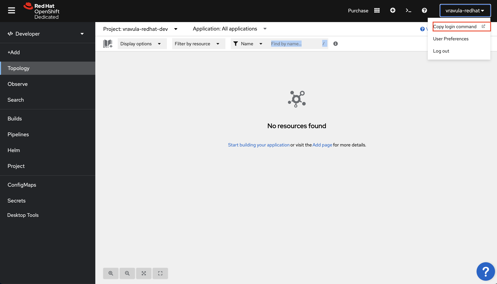
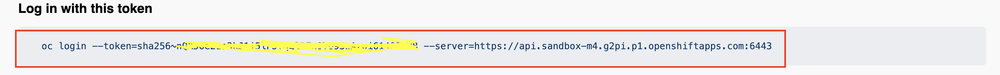
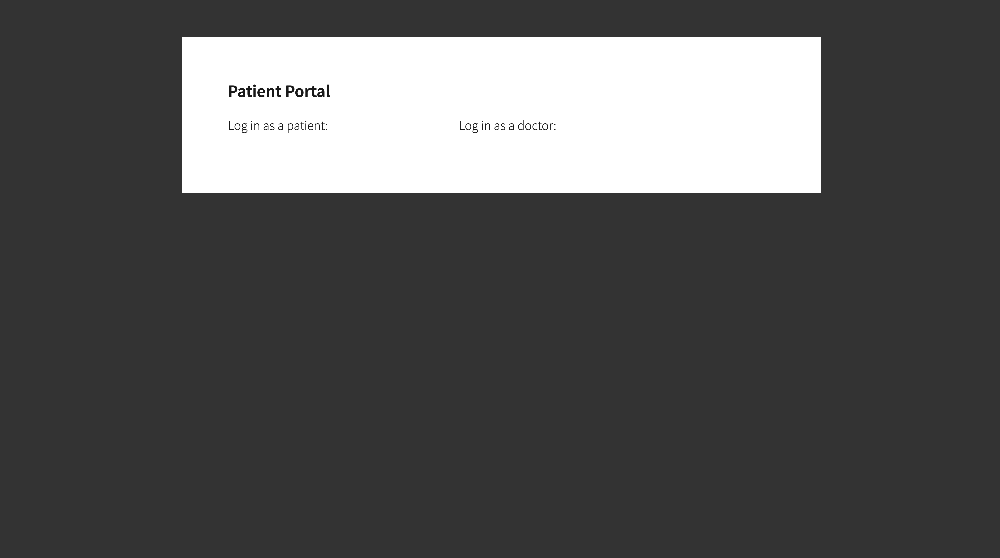
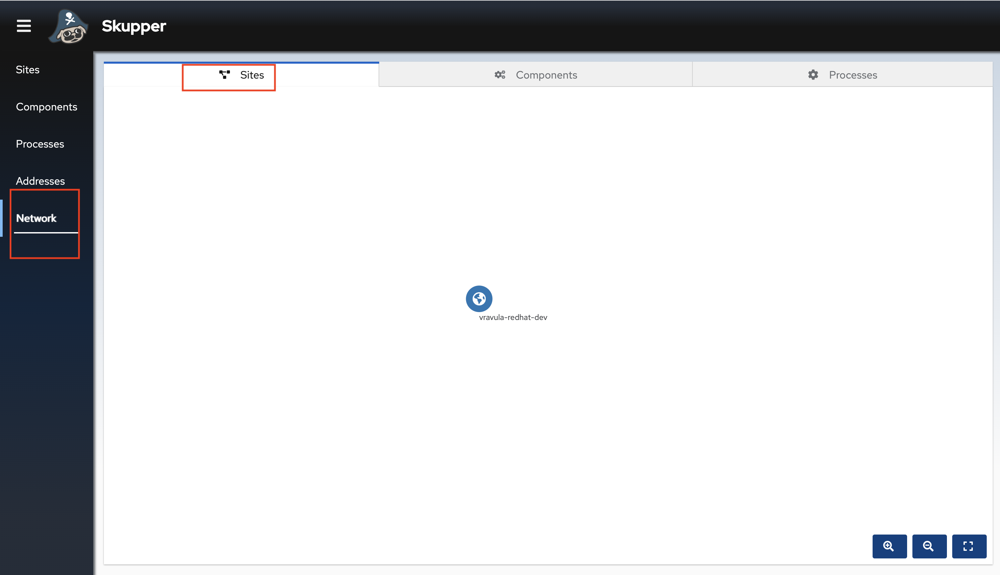
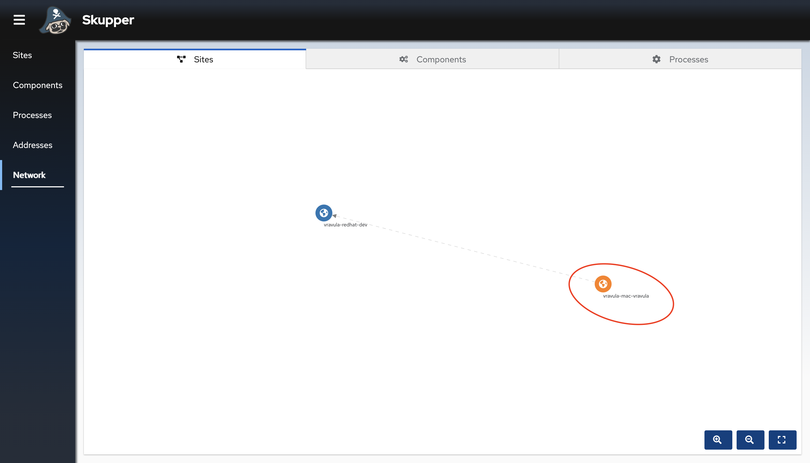
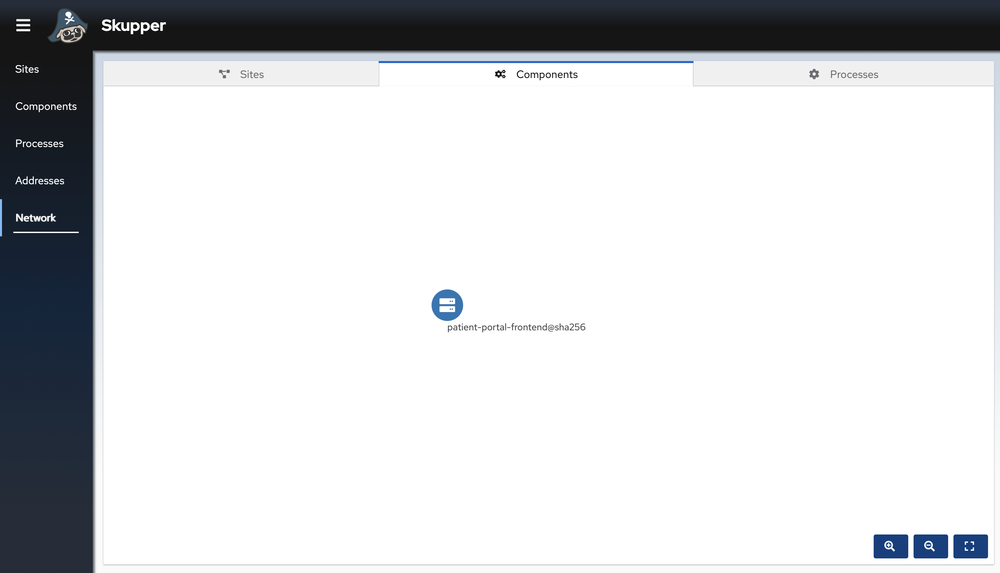
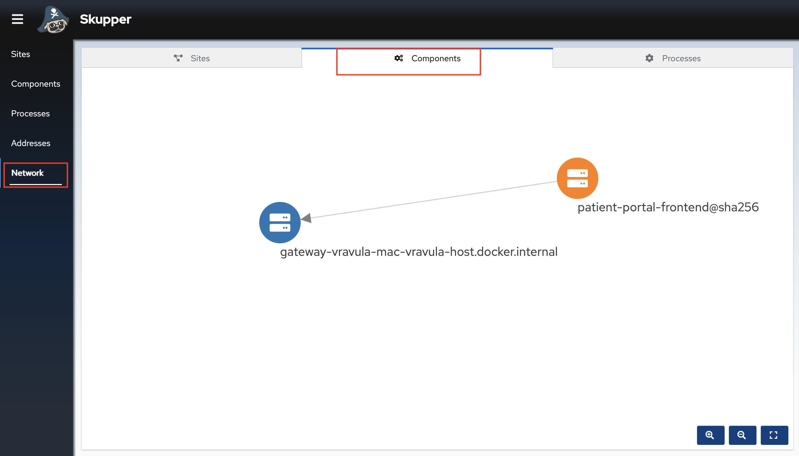
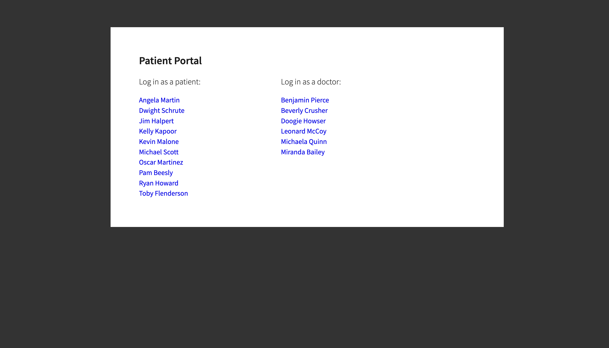

# ServiceInterConnect_DeveloperSandbox
This guide introduces Skupper to create a Virtual Applications Network (also known as a service network) and create connections across multiple clouds.

In this guide you will discover how to build a service network to connect disparate services across different environments using Red Hat Service Interconnect.

## What is Red Hat Service Interconnect?
Red Hat Service Interconnect enables application and service connectivity across different environments through layer 7 addressing and routing. Using a simple command line interface, interconnections are created in a matter of minutes, avoiding extensive networking planning, and overhead. All interconnections between environments use mutual TLS(mTLS) to keep your organization’s infrastructure and data protected. Red Hat Service Interconnect is based on the open source Skupper project.

## Overview

This example is a simple database-backed patient portal web application that shows how you can use Skupper to access a database at a remote site(local laptop) without exposing it to the public internet.

It contains two services:

A PostgreSQL database running on your local machine  which we assume as a private data center.

A web frontend service running on Kubernetes in the public cloud. It uses the PostgreSQL database to display the names of doctors and patients.

This example uses the Red Hat Developer Sandbox and your local laptop to deploy the frontend and the database respectively. Below are list of perquisites:
- Podman or Docker installed on your local machines
- An Active Red hat Developer Sandbox. Use these [instructions](https://developers.redhat.com/articles/2023/03/30/how-access-developer-sandbox-red-hat-openshift#access_the_developer_sandbox_for_red_hat_openshift) to set up your sandbox if you haven't already. 
- [OpenShift CLI](https://docs.openshift.com/container-platform/4.13/cli_reference/openshift_cli/getting-started-cli.html) installed on your local machine

## Install the Frontend app on your OpenShift Cluster

- Login in the developer sandbox and copy the login command



- Copy the login token and paste into your terminal to login to your cluster


- Deploy the frontend app on your OpenShift Sandbox cluster
```
oc new-app quay.io/redhatintegration/patient-portal-frontend
oc expose deployment patient-portal-frontend --port=8080
oc create route edge --service=patient-portal-frontend --insecure-policy=Redirect
oc set env deployment/patient-portal-frontend DATABASE_SERVICE_HOST=database
oc get route patient-portal-frontend -o jsonpath='{.spec.host}{"\n"}'

```
- The final command will display the OpenShift route URL for the front end app. Copy and paste that URL into the browser. The URL will look somewhat similar to the below
```
patient-portal-frontend-vravula-redhat-dev.apps.sandbox-m4.g2pi.p1.openshiftapps.com
```

- You should be able to see the front end of the patient portal without any patient names or doctor names as we have not established the connection with the database


## Install the Database on your laptop
The Database contains a list of patients and doctors, that will show on the patient portal front end page once we make the connections using Red Hat Service Interconnect (Skupper). In a real world scenario the database could be on a VM, private data centre or other bare metal environments. In this example we will be leveraging either Docker or podman on your local laptop or computer to deploy the database.

- Run the database on your local environment (Reminder this steps assume that you have already installed docker or podman locally)
     - Deploy the database on Mac M1
     ```
     docker run --name database --detach --rm -p 5432:5432 quay.io/redhatintegration/patient-portal-database-arm64
     ```
     - Deploy the database on Amd 64 or x86 environments ex: Macs with am Intel chip
     ```
     docker run --name database --detach --rm -p 5432:5432 quay.io/redhatintegration/patient-portal-database
     ```
     - Deploy the database with podman on RHEL machine
     ```
     podman run --name database --detach --rm -p 5432:5432 quay.io/redhatintegration/patient-portal-database
     ```

## Connect the database to the frontend using Red Hat Service Interconnect
The challenge for us is now to enable the patient portal frontend deployed on the sandbox to connect to the database. For obvious reasons, we do not want to expose the database over the public internet, so a private, secure link needs to be setup between the OpenShift sandbox instance and the database on your computer. This can be accomplished with a VPN between the public cloud and the data center. However a **VPN can be hard to set up**, and **requires deep networking expertise**. Developers also need to request the network admins and go through a time taking approval process for the VPNs to be setup. **Red Hat Service Interconnect on the other hand creates a dedicated layer 7 service network and is a lot easier to set up**. It allows application Developers to establish secure interconnection with other services and applications in different environments without relying on network specialists. With Service Interconnect developers can now create secure virtual application networks without the cumbersome overhead, complexity and delays of traditional connectivity solutions.

- Install Red Hat Service Interconnect
```
curl https://skupper.io/install.sh | sh
```
- You should see an output similar to the one below. Export the path if suggested in the output 
```,nocopy
export PATH="/Users/vravula/bin:$PATH"
```

- Initialize Service Interconnect in the sandbox
```
skupper init --enable-console --enable-flow-collector --console-auth unsecured
```
- You should see an Output similar to the one below 
```,nocopy
Skupper is now installed in namespace 'user-dev'.  Use 'skupper status' to get more information.
```
- Service Interconnect provides observability out of the box and comes with its own console. Below command should display the URL for the console
```
skupper status
```
- You should see an output similar to the one below 
```,nocopy
Skupper is enabled for namespace "username-dev" in interior mode. It is not connected to any other sites. It has no exposed services.
The site console url is:  https://skupper-username-dev.apps.sandbox-m4.g2pi.p1.openshiftapps.com
```
- Copy the console URL and paste in a new browser tab. You should able to see the sandbox cluster namespace displayed in the console. At the moment there is not a lot to see as we have only installed one side of the service network.


- Now that you have established a service network, you can expose services from a local machine on the service network.A service network enables communication between services running in different network locations. For example, if you run a database on a server in your data center, you can deploy a front end in a cluster that can access the data as if the database was running in the cluster.

- Initialize the gateway 
    - For Docker (Tried on Mac)
        ```
        skupper gateway init --config simple_docker.yaml --type docker
        ```
    - For Podman (Tried on RHEL)
        ```
        skupper gateway init --config simple_podman.yaml --type podman
        ```

- You should see an output similar to the one below 
```,nocopy
Skupper gateway: 'username-mac-username'. Use 'skupper gateway status' to get more information.
```
- Your local computer should now appear in the console

Though we have linked both the cluster and your local environment, we have not exposed any services yet. We have to explicitly mention which services we want to expose over the Service network. By default none of the services  are exposed by Red Hat Service Interconnect.

- Verify the same by going back to the console. Click on the components tab. You should not be able to see services other than the front end


- Now let's expose the database service over the service network. This will allow the Frontend on the Public cluster to connect to the database as if it was a local service, while in reality the service is a proxy for the real service running on your computer.

- Expose the database over the service network
```
skupper expose service database --address database --port 5432 --protocol tcp
```

- You should see an output similar to the one below 
```,nocopy
service database exposed as database
```
- You have now established a secure link between and exposed the database as service on your OpenShift Sandbox cluster.


> **Note:**
> We are not exposing the database and payment processor service to the internet. Only the services which are part of the service network enabled by Red Hat Service Interconnect can access them

- Get a list of services deployed in the sandbox namespace
    ```
    oc get service
    ```
- You should see an output similar to the one below
```,nocopy
NAME                      TYPE        CLUSTER-IP       EXTERNAL-IP   PORT(S)                               AGE
database                  ClusterIP   172.30.208.188   <none>        5432/TCP                              8m55s
modelmesh-serving         ClusterIP   None             <none>        8033/TCP,8008/TCP,8443/TCP,2112/TCP   7d3h
patient-portal-frontend   ClusterIP   172.30.144.46    <none>        8080/TCP                              77m
skupper                   ClusterIP   172.30.54.88     <none>        8010/TCP,8080/TCP,8081/TCP            47m
skupper-router            ClusterIP   172.30.102.71    <none>        55671/TCP,45671/TCP                   47m
skupper-router-local      ClusterIP   172.30.75.28     <none>        5671/TCP                              47m
```

The database service is the proxy service created by exposing the database deployment on your local environment over the service network.

- After a few seconds go back to the browser tab where you have opened the patient portal front end and refresh it. You should now be able to see the the list of patients and doctors that have been retrieved from the database. This shows that we have successfully connected our front end to the database using Red Hat Service Interconnect.


> **Note:**
> If the patient data still doesn't show up after establishing the connection, try restarting the frontend pod
```
oc get pods
oc delete pod <podname>
```

- Congratulations! You successfully used Red Hat Service Interconnect to build a secure service network between services on two different environments and allowed application to connect and communicate over the secure network.


